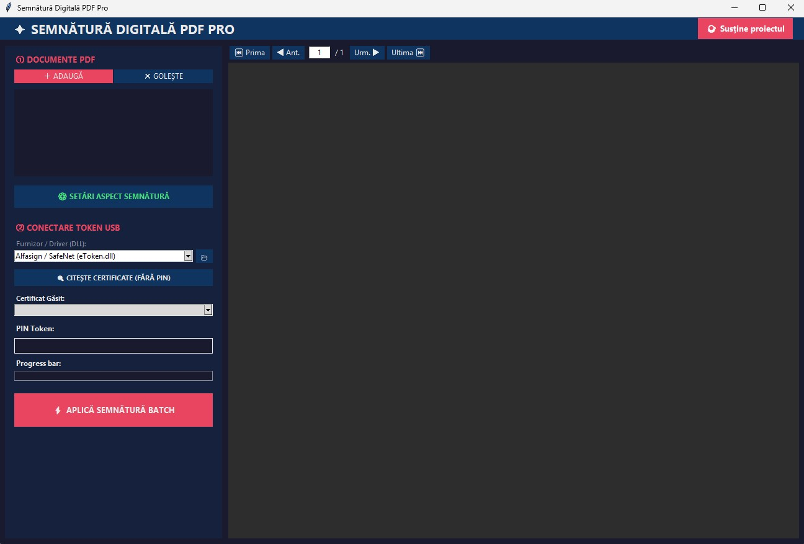

# Semnătură Digitală PDF Pro

O aplicație desktop modernă și intuitivă pentru semnarea electronică în bloc (batch) a documentelor PDF folosind token-uri hardware (HSM/USB cu PKCS#11).
Aplicația permite încărcarea și previzualizarea documentelor, definirea chenarului de semnătură pe o pagină specifică prin drag-and-drop și aplicarea unei semnături electronice calificate pentru mai multe documente simultan.

## 🌟 Funcționalități Principale

- **Încărcare multiplă:** Adaugă documente PDF prin Drag & Drop sau din file explorer.
- **Previzualizare și Navigare:** Vizualizare rapidă a fiecărui PDF. Dacă are mai multe pagini, poți folosi scroll, navigația cu butoane sau sări direct la o pagină anume.
- **Poziționare Vizuală (Drag to Select):** Poziționează exact locul unde va apărea semnătura vizibilă desenând un dreptunghi cu mouse-ul.
- **Ștergere dinamică:** Elimină oricând din listă fișierele introduse din greșeală, eliberând totodată memoria poziției setate anterior.
- **Suport Multi-Token PKCS#11:** Detectare automată și integrare nativă cu majoritatea furnizorilor de semnătură din România (CertSign, DigiSign, AlfaSign, CertDigital, etc.) pentru Windows și Linux.
- **Aspect 100% Personalizabil:** Controlează formatul semnăturii tale aparente (Nume, Motiv, Locație, Dată), mărimea fontului, culori, grosimea conturului și chiar inserarea unui logo propriu. Setările de personalizare beneficiază de previzualizare Live.
- **Semnare în Bloc (Batch Sign):** După ce trasezi chenarele pe rând pentru toate PDF-urile, introduci un singur PIN, iar aplicația le va semna electronic pe toate pe rând.
- **Gestionare clară a erorilor:** În caz de protecție cu parolă, document corupt, sau eroare la conectarea tokenului USB, aplicația continuă și la final prezintă un raport clar al documentelor eșuate.

## Release v1.02

✨ Noutăți (New Features)
Scrollbar: A fost adăugat un scrollbar pentru o navigare mult mai ușoară în interfață.
Logging extensiv: A fost integrat un sistem detaliat de loguri (jurnal de evenimente) care facilitează diagnosticarea rapidă a oricăror probleme de rulare.

🛠️ Corecții (Bug Fixes)
Poziționarea semnăturilor: A fost corectată o problemă de aliniere și rotație. Selecția cu mouse-ul se aplică acum cu precizie exactă pe document, indiferent de orientarea sau rotația originală a PDF-ului.

## 🚀 Instalare și Configurare

### Pentru utilizatorii Windows 🪟

Aplicația folosește un mediu Python portabil preconfigurat (`python_env`), așadar **nu este necesar să instalezi Python manual în sistemul tău**.

**[📥 Descarcă Aplicația (v1.02 .zip)](https://github.com/ionutanton/pdf-e-signer/releases/download/v1.02/pdf-e-sign-v1.02.zip)**

1. Descarcă și extrage arhiva în calculatorul tău.
2. Rulează fișierul **`install.bat`** (cu dublu click). Acesta va folosi automat Python-ul portabil pentru a descărca și instala pachetele necesare.

### Pentru utilizatorii Linux 🐧 (Ubuntu/Debian)

*Mulțumiri speciale lui **Dan Stoian** pentru colaborare la dezvoltarea și testarea suportului pentru Linux!*

1. Clonează sau descarcă proiectul.
2. Oferă drepturi de execuție scripturilor: `chmod +x install.sh pdf-e-sign.sh`
3. Rulează scriptul de instalare în terminal: `./install.sh`. Acest script va descărca pachetele de sistem necesare (`python3-venv`, `python3-tk`) și va crea un mediu virtual izolat (`python_env`) unde se vor instala dependențele.

## 🛠️ Utilizare

**Pentru Windows:** Rulează **`pdf-e-sign.bat`** (dublu click).
**Pentru Linux:** Rulează **`./pdf-e-sign.sh`** în terminal.

*(Aceste scripturi lansează aplicația folosind automat mediul izolat preconfigurat)*

### Fluxul de Semnare:
1. Trage PDF-urile în fereastră.
2. Selectează câte un fișier din listă și trage cu mouse-ul un pătrat pe document (se va trasa conturul roșu al semnăturii).
3. Conectează token-ul USB, alege driverul (furnizorul) din panoul din stânga.
4. Apasă "Citește Certificate", selectează certificatul din listă și introdu PIN-ul.
5. Apasă butonul "Aplică Semnătură Batch".
6. Toate PDF-urile procesate vor fi salvate automat într-un folder nou generat, numit **`Semnate`**, aflat în aceeași locație cu fișierul sursă.

## ☕ Susține Proiectul

Această aplicație a fost creată pentru a automatiza procesul repetitiv de semnare a documentațiilor (D.T.A.C., P.Th., documentații ISU) și pentru a salva ore prețioase de muncă. Este un instrument dezvoltat pentru a rezolva o problemă reală din fluxul nostru de lucru și este oferit gratuit comunității de proiectanți.

Dacă acest soft te-a ajutat să predai un dosar mai repede și ți-a salvat timp pe care altfel l-ai fi pierdut cu click-uri manuale, ia în calcul să susții dezvoltarea lui. Codul este scris și întreținut în timpul meu liber, iar orice sprijin mă ajută să păstrez aplicația gratuită, funcțională și să îi adaug noi îmbunătățiri pe viitor.

👉 **[Fă-mi cinste cu o cafea pe Buy Me a Coffee!](https://buymeacoffee.com/ionutanton)**

*Mulțumesc! Orice contribuție este enorm apreciată.*

## 📄 Licență

Acest proiect este licențiat sub **[Creative Commons Attribution-NonCommercial 4.0 International (CC BY-NC 4.0)](https://creativecommons.org/licenses/by-nc/4.0/deed.ro)**.

**Pe scurt, ai libertatea să:**
* **Partajezi** — să copiezi și să redistribui materialul în orice mediu sau format.
* **Adaptezi** — să remixezi, să transformi și să construiești pe baza materialului.

**Sub următoarele condiții:**
* 👤 **Atribuire** — Trebuie să oferi creditul corespunzător, să oferi un link către licență și să indici dacă ai făcut modificări.
* 🚫 **Necomercial** — Nu poți utiliza materialul în scopuri comerciale. 

Pentru utilizare comercială sau distribuție integrată în produse plătite, vă rugăm să contactați autorul proiectului pentru a obține o licență separată.